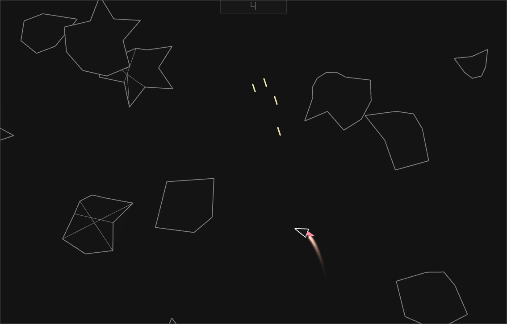

# Asteroids 2



## About

My friend told me that he would be interested in trying to mess 
around with this.
Since my previous 5-day long project of asteroids was a mess,
i decided to do the things again.

Also i wanted to add more things to this project like shaders, actual ui and other things, Just For Fun.

If you want to know why previous asteroids was a mess, take a look [here](https://github.com/amuerta/01_asteroids).

## "Features"

- cool :o
- self contained executable (no asset files, installers needed)
- avialble on windows and linux
- "moddable architecture" or something

## Obtaining

1. Go to release page
2. Get `asteroids2.exe` for windows or `asteroids2` for linux
3. Make executable runnable (on linux) or make Windows defender chill (on windows)
4. Run the game

> **_NOTE:_**  Windows defender will be yapping because i didn't sign exectuable. If you have something against it, build it from source.

## Building

1. Bootstraping buildsystem
```console
    cc -o build.c build
```

2. Building the project
```console
    ./build win # available options: [lin, win, lintowin]
```

3. "I don't know how to use build script"
```console
    ./build help
```

4. Running executable
```console
    # you can do two things
    # first:
    ./bin/main(.exe)

    #second:
    ./build run
```


